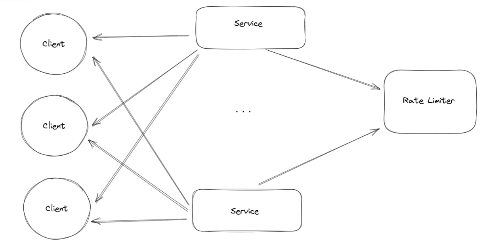
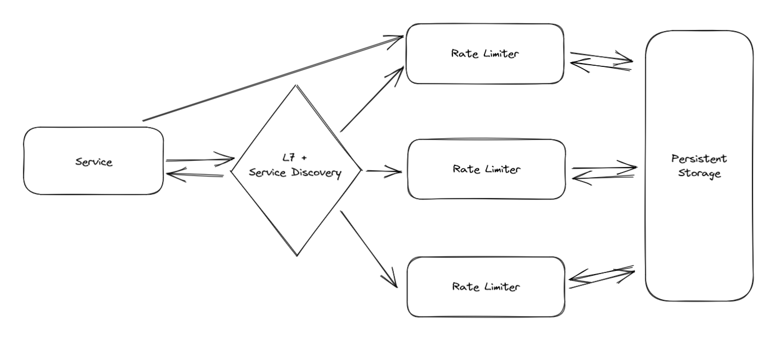

# rate-limiter
## Описание алгоритма:
Реализуем rate-limiter, который пропускает не больше заданного числа запросов в заданый
промежуток времени. Id временного окна рассчитываем как текущее время в миллисекундах,
деленное на размер окна. Id уникален для любого временного окна.
Какое-то время храним id прошедших временных окон и значения счетчиков запросов для них,
предполагается, что неактульные временные окна и их счетчики удаляются по расписанию
демон-процессом.
## Доказательство корректности:
Предполагается использование rate-limiter'а нескольскими потоками одновременно,
для того, чтобы это было возможно, используем ConcurrentHashMap, а в качестве
счетчика количества запросов во временном окне используем AtomicInteger, чтобы 
инкрементирование счетчика было атомарной операцией, и мы не теряли значения и 
счетчик всегда показывал актуальную информацию о количестве одобренных запросов.
Цель алгоритма - чтобы не больше, чем заданное число запросов в данном окне,
получали разрешение на выполнение. Так как управление у потока может быть 
отобрано в любой момент и на неопределенное время, перед тем, как возвращать
результат, мы проверяем, что мы находимся все еще в данном временном окне, в противном
случае наше условие на количество запросов во временное окно может быть нарушено.
Также в нашем rate-limiter'е предусмотрена возможность динамического изменения 
допустимого количества запросов за временное окно. Чтобы все потоки одновременно
увидели изменение этой переменной, она объевлена как volatile.

### [Требования](REQUIREMENTS.md)

## Идея распределенного rate-limiter'а
У нас есть кластер с большим количеством сервисов, которые отправляют сообщения клиентам.
В качестве клиентов могут выступать как реальные пользователи, так и сервисы с техническими учётными данными.
Мы хотим, чтобы наши сервисы не отправляли сообщения клиентам слишком часто, чтобы не
перегружать их. Для этого в нашей системе появится специальный компонент rate-limiter,
перед каждой отправкой сообщения клиенту, мы будем спрашивать у него "разрешения".

Таким образом, rate-limiter может превратиться в единую точку отказа системы, поэтому стоит 
его сделать высокодоступным и надежным. Для этого сделаем несколько реплик rate-limiter'а,
добавим L7-балансировщик. который также будет выполнять функции service-registry -
следить за состоянием реплик.

Для каждой реплики у нас будут отдельные счетчики запросов, также считаем количество 
запросов для каждого клиента, чтобы не отправить слишком много сообщений.
Когда rate-limiter становится распределенным, возникает серьезная проблема: если одна или
несколько реплик упадут, нужно увеличивать допустимые лимиты запросов на остальных репликах,
иначе мы рискуем слать меньше трафика, чем должны. Для этого service registry будет рассылать
репликам коэффициент, во сколько раз нужно поменять лимит на количество запросов во временное 
окно. В БД будут храниться настройки rate-limiter'а для каждого клиента, чтобы поднявшиеся реплики 
могли успешно инициализироваться и вернуться в балансировку.
## Плюсы подхода
- простая архитектура
- rate-limiter работоспособен даже в том случае, когда часть узлов вышла из строя
- адаптируем лимиты в зависимости от количества реплик
- передаем мало данных по сети (id клиента или команду на изменение размера лимитов)
## Минусы подхода
- сложно точно определить, сколько запросов успело пройти через упавшие реплики, можем
отправить больше запросов, чем должны были, в окне, когда какая-то реплика упала
- необходимо регулярно чистить счетчики для неактуальных окон
- не совсем гибкая настройка, запросы по сервисам могут распределяться нечестно,
пришлось идти на компромисс, так как, если бы заводили счетчик для каждого сервиса и клиента, 
при падении части реплик пришлось бы более долго обновлять лимиты на живых репликах, 
был бы риск пропустить слишком мало запросов
